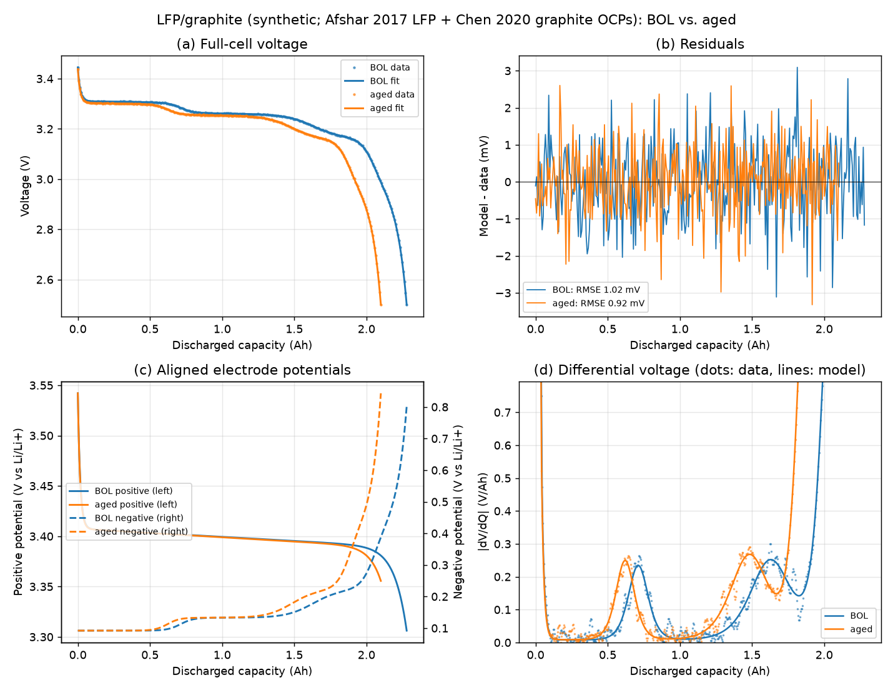
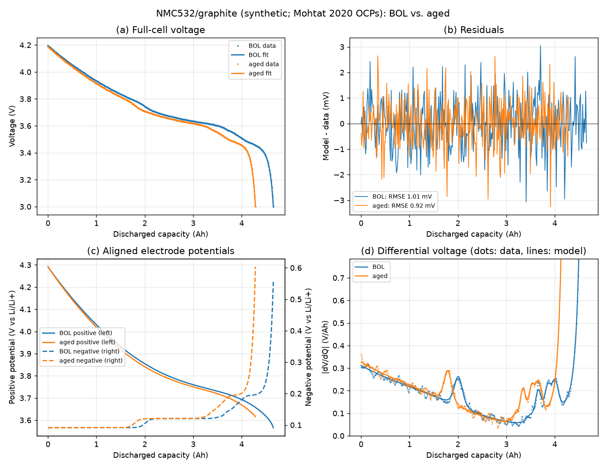

# ocvfit

[](https://github.com/catnap042/ocvfit/actions/workflows/ci.yml)
[](https://github.com/catnap042/ocvfit/blob/main/pyproject.toml)
[](LICENSE)

**Fit full-cell open-circuit voltage (OCV) curves from half-cell OCP curves and
quantify lithium-ion battery degradation modes (LLI, LAM_PE, LAM_NE), with honest
identifiability checks.**

`ocvfit` is a small Python package (NumPy and SciPy; Matplotlib is optional) for
non-destructive battery diagnostics by *electrode alignment*. A low-rate
full-cell voltage curve is rebuilt from the open-circuit potentials of the
positive and negative electrodes. The fitted electrode capacities and lithium
inventory then show how the cell has aged: loss of lithium inventory (LLI) and
loss of active material on each electrode (LAM_PE, LAM_NE). The package works
for single-material and blended electrodes. It never extrapolates half-cell
curves. For every degradation mode it reports whether the data actually
determine the value or only bound it to an interval. All examples run on
synthetic data built from published OCP functions, so no measured data are
bundled.

| LFP/graphite (headline example) | NMC532/graphite |
|---|---|
|  |  |

## Features

- **Half-cell OCP curves**: shape-preserving PCHIP interpolation that never
  extrapolates, conversion from delithiation-SOC axes, PAVA monotonisation,
  inverse curves, and adaptive PCHIP compression of dense data.
- **Three full-cell models**:
  - `CathodeFixedModel`: 3 parameters (`Kn`, `Sn`, `V_offset`). A fast baseline.
  - `WindowModel`: free electrode windows (`y0`, `y100`, `x0`, `x100`, `V_offset`) and optional blend fractions.
  - `CapacityModel`: absolute capacities `Q_PE`, `Q_NE`, cyclable lithium `n_Li` and offset `R`, with an optional full-charge voltage anchor.
- **Blended positive electrodes** (for example NMC + LFP) with one capacity per
  component. Lithium is shared between components at a common potential.
- **Robust fitting**: Huber loss, edge and slope-aware weights, end-point
  anchoring and a valid-region penalty. Optimisers are grid pre-screening,
  L-BFGS-B, Nelder-Mead and differential evolution. The capacity model uses a
  two-stage `soft_l1` then least-squares fit.
- **Degradation modes**: LLI, LAM_PE (per component) and LAM_NE, plus the
  feasible range of side-reaction lithium loss.
- **Identifiability**: profile-likelihood intervals corrected for residual
  correlation, a bias budget from perturbed reference curves, and a 1
  percentage-point verdict.
- **ICA/DVA**: dQ/dV and dV/dQ with Savitzky-Golay filtering, and peak detection.
- **Plotting**: a four-panel fit report.
- **Literature OCP functions**: LFP, NMC811, NMC532 and two graphites, for
  examples, tests and synthetic studies.

## Table of contents

- [Installation](#installation)
- [Quickstart](#quickstart)
- [Usage guide](#usage-guide)
  - [1. Half-cell OCP curves](#1-half-cell-ocp-curves)
  - [2. Full-cell models](#2-full-cell-models)
  - [3. Fitting](#3-fitting)
  - [4. Degradation modes and identifiability](#4-degradation-modes-and-identifiability)
  - [5. dQ/dV and dV/dQ](#5-dqdv-and-dvdq)
  - [6. Plotting](#6-plotting)
  - [7. Using your own CSV data](#7-using-your-own-csv-data)
- [Worked examples](#worked-examples)
  - [LFP/graphite (headline)](#lfpgraphite-headline)
  - [NMC532/graphite](#nmc532graphite)
- [Method and theory](#method-and-theory)
- [Using open datasets](#using-open-datasets)
- [FAQ and limitations](#faq-and-limitations)
- [Citing and references](#citing-and-references)
- [Contributing](#contributing)
- [License](#license)

## Installation

```bash
pip install git+https://github.com/catnap042/ocvfit
# with plotting support (Matplotlib)
pip install "ocvfit[plot] @ git+https://github.com/catnap042/ocvfit"
```

Development (editable) install with test dependencies:

```bash
git clone https://github.com/catnap042/ocvfit
cd ocvfit
pip install -e ".[test]"
pytest
```

Requires Python 3.10 or newer, NumPy 1.22 or newer and SciPy 1.9 or newer.

## Quickstart

```python
import ocvfit as of

# Synthetic LFP/graphite cell: BOL and aged low-rate discharge curves with known truth
cell = of.demo_cells("lfp")
model = of.CapacityModel(cell.positive, cell.negative, v_full=cell.v_full)  # 3.45 V rest at full charge

# Fit each curve (q = Ah discharged from full charge)
bol = of.fit_capacity(model, cell.q["BOL"], cell.voltage["BOL"])
aged = of.fit_capacity(model, cell.q["aged"], cell.voltage["aged"])
print(aged.summary())

modes = of.degradation_modes(bol, aged)
print({k: round(100 * modes[k], 2) for k in ("LLI", "LAM_PE", "LAM_NE")})  # percent
print("true:", {k: round(100 * v, 2) for k, v in cell.true_modes.items()})

# Profile interval of a mode (add the bias budget for the final interval, see the usage guide)
lo, hi = of.mode_interval(bol, aged, "LAM_NE")
print(f"LAM_NE profile interval: [{100 * lo:.2f}, {100 * hi:.2f}] %")
```

## Usage guide

All public functions are available from the top-level `ocvfit` namespace. Each
snippet below is self-contained.

### 1. Half-cell OCP curves

Electrode curves are `OCPCurve` objects. Each is a function `U(x)` of the
**lithiation fraction** `x` (0 = delithiated, 1 = lithiated), in V vs Li/Li+,
so both electrodes' potentials decrease with `x`. Interpolation is PCHIP and
returns `nan` outside the data range.

```python
import numpy as np
import ocvfit as of

# From arrays on a lithiation axis (order and duplicates do not matter)
x = np.linspace(0.0, 1.0, 101)
graphite = of.OCPCurve(x, of.LITERATURE_OCP["graphite_chen2020"](x), name="graphite")

# From a half-cell recorded against SOC that grows with delithiation (x = 1 - soc)
soc = np.linspace(0.0, 1.0, 101)
u_pos = of.LITERATURE_OCP["lfp_afshar2017"](1.0 - soc)
lfp = of.OCPCurve.from_soc(soc, u_pos, coordinate="delithiation", name="LFP", smooth_window=1)

# Published literature curves
nmc = of.literature_ocp("nmc811_chen2020", x_min=0.27, x_max=0.90)
print(sorted(of.LITERATURE_OCP))

print(graphite(0.5), graphite(1.2))   # second value is nan: no extrapolation
print(lfp.x_range, lfp.voltage_range)
print(lfp.lithiation(3.40))           # inverse curve x(U), saturated at the ends

# Repair a slightly non-monotone measured segment (pool-adjacent-violators)
print(of.monotonize([3.50, 3.45, 3.46, 3.40], decreasing=True))

# Compress a dense curve to a few PCHIP knots within 1 mV and rebuild it
xd = np.linspace(0, 1, 3000)
knots, report = of.compress_pchip(xd, of.LITERATURE_OCP["graphite_chen2020"](xd), tol=1e-3)
print(report["n_knots"], report["max_error"])
graphite_small = of.OCPCurve.from_knots(knots, name="graphite")
```

### 2. Full-cell models

Every model maps a parameter vector and an abscissa (SOC, or discharged capacity
for `CapacityModel`) to the full-cell voltage. `components()` also returns
the electrode potentials, the lithiation fractions and the valid mask.

```python
import numpy as np
import ocvfit as of

pos = of.literature_ocp("nmc811_chen2020", 0.27, 0.90)
neg = of.literature_ocp("graphite_chen2020")
soc = np.linspace(0, 1, 50)

# (a) Cathode-fixed: params [Kn, Sn, v_offset]
cf = of.CathodeFixedModel(pos, neg)
v = cf([1.1, 0.05, 0.0], soc)
print(cf.param_names, cf.valid_soc_range([1.1, 0.05, 0.0]))

# (b) Free windows: params [y0, y100, x0, x100, v_offset]
wm = of.WindowModel(of.literature_ocp("nmc811_chen2020"), neg)
v = wm([0.90, 0.27, 0.03, 0.91, 0.0], soc)

# (b') Blended positive: an extra capacity-fraction parameter per additional component
lfp = of.literature_ocp("lfp_afshar2017")
lfp.name = "LFP"
wb = of.WindowModel([of.literature_ocp("nmc811_chen2020"), lfp], neg)
print(wb.param_names)  # [..., 'frac_LFP']

# (c) Capacity model on a capacity axis (Ah): params [Q_pe, Q_ne, n_li, R]
cm = of.CapacityModel(of.literature_ocp("lfp_afshar2017"), neg, v_full=3.45)
q = np.linspace(0, 2.0, 50)
comp = cm.components([2.5, 2.75, 2.4125, 0.005], q)
print(comp.voltage[:3], comp.positive[:3], comp.negative[:3], comp.valid.all())
print(cm.state([2.5, 2.75, 2.4125, 0.005], q_end=2.0))  # x100, y100, x0, y0, N/P ...

# Without a rest-voltage anchor, x100 becomes a free parameter
print(of.CapacityModel(of.literature_ocp("lfp_afshar2017"), neg).param_names)
```

### 3. Fitting

`fit_ocv` fits SOC-axis models. `fit_capacity` fits `CapacityModel`. Both
return a `FitResult` with `params`, `param_dict`, `fitted`, `residuals`,
`rmse`, `mae`, `max_abs_error`, `valid_fraction`, `summary()` and `to_dict()`.

```python
import numpy as np
import ocvfit as of

pos = of.literature_ocp("nmc811_chen2020", 0.27, 0.90)
neg = of.literature_ocp("graphite_chen2020")
model = of.CathodeFixedModel(pos, neg)
soc = np.linspace(0, 1, 120)
v = model([1.1, 0.05, 0.01], soc) + np.random.default_rng(0).normal(0, 1e-3, soc.size)

# loss: "v2" (Huber + edge/slope weights + end anchor), "rmse" (weighted), "mse"
# method: "fast" (pre-screen + L-BFGS-B + Nelder-Mead), "differential_evolution", "local"
fit = of.fit_ocv(model, soc, v, loss="v2", method="fast",
                 huber_delta=2e-3, lambda_edge=50.0, edge_frac=0.05, slope_weight=0.5,
                 min_valid_ratio=1.0)
print(fit.summary())

fit_de = of.fit_ocv(model, soc, v, loss="mse", method="differential_evolution",
                    bounds=[(0.8, 1.3), (-0.2, 0.3), (-0.1, 0.1)], seed=1)
print(fit_de.param_dict, f"{1e3 * fit_de.rmse:.2f} mV")

# Capacity model: grid pre-screen -> best n_starts -> soft_l1 (f_scale) -> least squares
cell = of.demo_cells("nmc532")
cm = of.CapacityModel(cell.positive, cell.negative, v_full=cell.v_full)
cfit = of.fit_capacity(cm, cell.q["BOL"], cell.voltage["BOL"], n_starts=10, f_scale=5e-3)
print(cfit.to_dict()["state"])
```

Tuning tips for the `"v2"` objective: increase `lambda_edge` (50, then 100,
then 200) if the curve ends fit poorly. Increase `huber_delta` (2 mV to 3 mV)
if the ends contain outliers. Adjust `edge_frac` (0.03 to 0.08) to define the
end regions.

### 4. Degradation modes and identifiability

```python
import ocvfit as of

cell = of.demo_cells("lfp")
model = of.CapacityModel(cell.positive, cell.negative, v_full=cell.v_full)
bol = of.fit_capacity(model, cell.q["BOL"], cell.voltage["BOL"])
aged = of.fit_capacity(model, cell.q["aged"], cell.voltage["aged"])
modes = of.degradation_modes(bol, aged)  # fractions; also dn_li_Ah, dQ_pe_Ah, dQ_ne_Ah

# Correlation-corrected profile interval of each mode (from both fits)
intervals = {k: of.mode_interval(bol, aged, k) for k in ("LLI", "LAM_PE", "LAM_NE")}

# Reference-curve bias budget: perturb half-cells (+/-3 mV offset, 2 mV shape), refit
def refit(positives, negative):
    m = of.CapacityModel(positives[0], negative, v_full=cell.v_full)
    b = of.fit_capacity(m, cell.q["BOL"], cell.voltage["BOL"], n_starts=3)
    a = of.fit_capacity(m, cell.q["aged"], cell.voltage["aged"], n_starts=3)
    return of.degradation_modes(b, a)

budget = of.bias_budget(refit, [cell.positive], cell.negative,
                        {k: modes[k] for k in intervals}, n_draws=8, seed=1)

for k, (lo, hi) in intervals.items():
    lo, hi = lo - budget[k], hi + budget[k]
    verdict = "identifiable" if of.is_identifiable(0.5 * (hi - lo)) else "interval only"
    print(f"{k}: {100 * modes[k]:.2f} % in [{100 * lo:.2f}, {100 * hi:.2f}] % -> {verdict}")

# Lower-level: profile one parameter of one fit
pr = of.profile_interval(aged, "n_li")
print(pr.interval, pr.rho, pr.threshold)

# Side-reaction share of the total lithium loss (feasible range, not a point value)
print(of.side_reaction_interval(bol, aged)["side_reaction_interval"])
```

For the 3-parameter cathode-fixed model, `cathode_fixed_indicators(bol_fit,
eol_fit, q_nominal)` returns the first-order indicators `LLI ~ dSn * Q` and
`LAM_NE ~ -dKn * Q`. Use them as indicators only, because the model assumes
LAM_PE = 0.

### 5. dQ/dV and dV/dQ

```python
import ocvfit as of

cell = of.demo_cells("nmc532", noise=0.0)
q, v = cell.q["BOL"], cell.voltage["BOL"]

V, dqdv = of.incremental_capacity(v, q, dv=2e-3, window=11, polyorder=3)  # uniform voltage grid
Q, dvdq = of.differential_voltage(q, v, window=21, polyorder=3)           # uniform capacity grid
peaks = of.find_ic_peaks(V, dqdv, height_ratio=0.1)
print(peaks["voltage"], peaks["height"])
```

Use low-rate data (C/20 to C/25) and a 2 to 5 mV voltage step. Too large a
window broadens peaks or shifts them, so check settings on reference curves.

### 6. Plotting

```python
import tempfile
from pathlib import Path

import matplotlib
matplotlib.use("Agg")

import ocvfit as of
from ocvfit.plotting import plot_fit_report

cell = of.demo_cells("lfp")
model = of.CapacityModel(cell.positive, cell.negative, v_full=cell.v_full)
fits = {k: of.fit_capacity(model, cell.q[k], cell.voltage[k]) for k in ("BOL", "aged")}
fig = plot_fit_report(fits, title="My cell")  # voltage, residuals, electrode potentials, |dV/dQ|
fig.savefig(Path(tempfile.mkdtemp()) / "report.png", dpi=120)
```

### 7. Using your own CSV data

Expected format: comma-separated, one header row, one curve per file.

| File | Columns | Notes |
|---|---|---|
| Half-cell curve | `x,voltage_V` | `x` = lithiation fraction 0-1 (or an SOC column with `coordinate="delithiation"`), voltage in V vs Li/Li+. Use the same current direction as the full-cell curve (important for LFP hysteresis). |
| Full-cell curve (capacity model) | `capacity_Ah,voltage_V` | Capacity discharged **from full charge** (starts at 0, increases), one low-rate discharge branch. |
| Full-cell curve (SOC models) | `soc,voltage_V` | Full-cell SOC 0-1 (0 = discharged). |

Column names are arbitrary, because you pass them explicitly. Example files
(synthetic, made by `examples/make_example_csv.py`) are in
[`examples/data/`](examples/data). Run this from the repository root:

```python
import ocvfit as of

pos = of.io.load_ocp("examples/data/lfp_halfcell.csv", "x", "voltage_V", name="LFP")
neg = of.io.load_ocp("examples/data/graphite_halfcell.csv", "x", "voltage_V", name="graphite")
q, v = of.io.load_xy("examples/data/lfp_fullcell_discharge.csv", "capacity_Ah", "voltage_V")

# v_full: measured rest voltage after a full charge. Pass None to fit x100 instead.
model = of.CapacityModel(pos, neg, v_full=3.45)
fit = of.fit_capacity(model, q, v)
print(fit.summary())

# Optional: store a compressed half-cell curve
knots, report = of.compress_pchip(neg.x, neg.voltage, tol=1e-3)
print(report["n_knots"], "knots")
```

Data that come as capacity in mAh against a delithiation axis can be turned
into a curve by normalising first, for example `soc = Q / Q_max`, then calling
`OCPCurve.from_soc(soc, U, coordinate="delithiation")`.

## Worked examples

Both cells are synthetic and have the same ground-truth ageing: **LLI 8 %,
LAM_PE 5 %, LAM_NE 6 %**. The offset grows from 5 to 12 mV, the voltage noise
is 1 mV, and each curve has 300 points. The end of discharge is limited by the
negative electrode in both cells. Final interval = correlation-corrected profile
interval +/- bias budget (half-cell curves perturbed by +/-3 mV offset and 2 mV
shape error, 8 draws). A mode is identifiable if the half-width is at most 1
percentage point.

### LFP/graphite (headline)

`python examples/quickstart.py`. OCPs: LFP from Afshar et al. 2017 and graphite
from Chen et al. 2020 (the pairing of the PyBaMM `Prada2013` set). BOL capacities
are Q_PE 2.5 Ah, Q_NE 2.75 Ah and n_Li 2.4125 Ah. The rest voltage is 3.45 V
and the discharge runs to 2.5 V.


| Mode | Fitted | True | Final interval | Verdict |
|---|---|---|---|---|
| LLI | 8.01 % | 8.00 % | [7.87, 8.16] % | identifiable |
| LAM_PE | 4.76 % | 5.00 % | [-11.7, 21.1] % | **not identifiable** |
| LAM_NE | 6.05 % | 6.00 % | [5.53, 6.58] % | identifiable |

Over 10 noise seeds: LLI 8.00 +/- 0.02 %, LAM_PE 5.06 +/- 0.26 %, LAM_NE 6.02 +/- 0.09 %.

**Interpretation.** LLI and LAM_NE are well determined. The graphite staging
transitions (the two dV/dQ peaks in panel d) fix the scale and position of the
negative electrode. LAM_PE is recovered well when only noise is present (the
profile interval alone is about +/-0.7 pp). However, the LFP plateau falls by
only about 20 mV over the whole lithiation range, and in this negative-limited
cell the steep lithiated end of the LFP curve is never reached. A few mV of
error in the reference curve can therefore mimic a large change in positive
capacity, so the bias budget for LAM_PE is about 16 pp. **Report LAM_PE as an
interval for such LFP cells.** If the discharge does reach the LFP end (a
positive-limited cell), LAM_PE becomes identifiable again with a bias below
0.1 pp (see `tests/test_lfp_identifiability.py`).

### NMC532/graphite

`python examples/quickstart.py --chemistry nmc532`. OCPs from Mohtat et al.
2020. BOL capacities are Q_PE 5.0 Ah, Q_NE 5.5 Ah and n_Li 4.875 Ah. The rest
voltage is 4.2 V and the discharge runs to 3.0 V.


| Mode | Fitted | True | Final interval | Verdict |
|---|---|---|---|---|
| LLI | 8.00 % | 8.00 % | [7.95, 8.05] % | identifiable |
| LAM_PE | 4.97 % | 5.00 % | [4.67, 5.26] % | identifiable |
| LAM_NE | 6.00 % | 6.00 % | [5.49, 6.51] % | identifiable |

Over 10 noise seeds: LLI 8.00 +/- 0.00 %, LAM_PE 4.98 +/- 0.07 %, LAM_NE 5.99 +/- 0.11 %.

**Interpretation.** The sloping NMC potential carries information about the
positive capacity across the whole window, so all three modes are identifiable.
LAM_NE has the widest interval, because the graphite end of the curve is the
steep, sparsely sampled end of discharge.

Further examples: [`examples/cathode_fixed.py`](examples/cathode_fixed.py) runs
the 3-parameter method on NMC811/graphite
([figure](docs/images/cathode_fixed.png)), and
[`examples/blended_cathode.py`](examples/blended_cathode.py) fits an NMC811 +
LFP blend.

## Method and theory

### Conventions

Every electrode curve is a function `U(x)` of the **lithiation fraction** `x`
in `[0, 1]` (potential in V vs Li/Li+), so both potentials decrease with `x`.
`x` denotes the negative and `y` the positive electrode. Half-cell data
recorded against a delithiation SOC are converted with
`OCPCurve.from_soc(soc, U, coordinate="delithiation")`. Curves are interpolated
with PCHIP (shape preserving, no overshoot between plateaus and steep regions)
and **never extrapolated**: points that would require an electrode outside its
measured range are flagged invalid.

### Full-cell voltage

All models evaluate both electrodes **on the same full-cell coordinate** and
subtract:

$$V = U_{PE}(y) - U_{NE}(x) + V_{offset}$$

**Cathode-fixed model** (full-cell SOC $s$, 0 = discharged). The positive
window is fixed to the whole reference curve, and the negative axis is
transformed before it is compared:

$$y(s) = y_{max} - s\,(y_{max}-y_{min}),\qquad u_n(s) = S_n + s/K_n$$

where $u_n$ is the normalised coordinate of the negative reference curve.
$K_n$ is the negative/positive capacity ratio in the window ($K_n>1$ compresses
the negative curve) and $S_n$ the slippage of its start point. A rising $S_n$
indicates lithium inventory loss, a falling $K_n$ loss of negative active
material. Because the positive window is fixed, LAM_PE cannot be detected and
is absorbed by the other parameters, so use this model as a fast baseline.

**Window model.** Both windows are free:

$$y(s) = y_0 + (y_{100}-y_0)\,s,\qquad x(s) = x_0 + (x_{100}-x_0)\,s$$

**Capacity model** (absolute capacity $q$ discharged from full charge, Ah):

$$L_{NE}(q) = x_{100} Q_{NE} - q,\qquad L_{PE}(q) = n_{Li} - x_{100} Q_{NE} + q$$

$$V(q) = U_{PE}\!\left(L_{PE}/Q_{PE}\right) - U_{NE}\!\left(L_{NE}/Q_{NE}\right) - R$$

with $n_{Li} = y_{100} Q_{PE} + x_{100} Q_{NE}$. If the rested full-charge
voltage $V_{full}$ is known, $x_{100}$ is solved from
$U_{PE}(y_{100}) - U_{NE}(x_{100}) = V_{full}$ (full-charge anchor), leaving
$Q_{PE}, Q_{NE}, n_{Li}, R$ free. Otherwise $x_{100}$ is fitted as well. $R$
lumps polarisation and reference mismatch. It is a fitted offset and should
not be read as a DC resistance.

### Blended electrodes

All active materials of an electrode share one potential at equilibrium. The
stored lithium is the sum over components,

$$L_{PE}(U) = \sum_k Q_k\, x_k(U),$$

and the blended potential is its numerical inverse. Each component has its own
capacity $Q_k$ and therefore its own LAM. Outside its measured potential range
a component is held at its end lithiation (phase exhausted or full), and
non-monotone measured segments are repaired with PAVA before inversion.
Potentials or SOCs are never averaged.

### Objectives and optimisation

For SOC-axis models (`fit_ocv`) the recommended `"v2"` objective is

$$J = \frac{\sum_i w_i\,\rho_\delta(r_i)}{\sum_i w_i} + \lambda_{edge}\left[\bar r_{low}^2 + \bar r_{high}^2\right] + \lambda_{valid}\max(0, f_{min} - f_{valid})$$

with Huber loss $\rho_\delta$ ($\delta$ = 2 mV), weights $w_i$ = edge weight
(x10 within 5 % of either end) times $1 + 0.5\,|dV/ds|/\mathrm{median}|dV/ds|$,
the mean residuals $\bar r$ of the two end regions, and a penalty on the
fraction of points outside the valid region (full coverage required by
default, so the optimiser cannot drop poorly fitted end points). Optimisation:
grid or random pre-screening, then L-BFGS-B and a Nelder-Mead polish, or
differential evolution.

For the capacity model (`fit_capacity`), starting points are pre-screened on a
grid of $(Q_{PE}, Q_{NE}, n_{Li})$ (and blend fractions), and the 10 best are
refined with a robust `soft_l1` least-squares fit (5 mV scale) followed by
ordinary least squares. Random starts often land in a solution where the wrong
electrode limits the end of discharge, which is why the grid pre-screen is
used. The few large residuals of the steep end of discharge otherwise make the
valley around the true solution too narrow for plain least squares.

### Degradation modes

$$LLI = 1 - \frac{n_{Li}^{aged}}{n_{Li}^{BOL}},\quad LAM_{PE} = 1 - \frac{Q_{PE}^{aged}}{Q_{PE}^{BOL}},\quad LAM_{NE} = 1 - \frac{Q_{NE}^{aged}}{Q_{NE}^{BOL}}$$

These three quantities are all that OCV data can determine (given unchanged
half-cell shapes, fully disconnected inactive material and uniform ageing).
The common five-mode split (side-reaction LLI plus lithiated/delithiated LAM of
each electrode) has two extra degrees of freedom that leave no trace in the
OCV. `side_reaction_interval` therefore reports the feasible range

$$\left[\max\left(0,\ \Delta n_{Li} - C_{max}\right),\ \Delta n_{Li} - C_{min}\right],\quad
C_{min} = x_0 \Delta Q_{NE} + y_{100} \Delta Q_{PE},\quad C_{max} = x_{100} \Delta Q_{NE} + y_0 \Delta Q_{PE}$$

and a point value only under an explicit assumption (material lost at full charge).

### Identifiability

Residuals along an OCV curve are strongly correlated, so naive confidence
intervals are far too narrow. `profile_interval` fixes one parameter, refits
the others and accepts values with

$$\Delta\chi^2 \le 3.84\,\frac{1+\rho}{1-\rho}$$

where $\rho$ is the lag-1 autocorrelation of the residuals (inflation capped at
100). `bias_budget` perturbs the half-cell curves (default +/-3 mV offset and
2 mV smooth shape error), refits, and takes the largest deviation. A quantity
whose final interval (profile interval +/- bias budget) has a half-width above
1 percentage point should be reported as an interval only (`is_identifiable`).

Whether an electrode or component capacity can be resolved depends on whether
the data show where its plateau starts and ends. For example, an LFP plateau at
the end of discharge in a negative-limited cell is only partially visible (see
[Example results](#example-results)).

## Using open datasets

No external data are redistributed here. To try real cells, download an openly
licensed dataset yourself, check its licence, and convert one low-rate
discharge branch plus matching half-cell curves to the CSV format above.

| Dataset | Chemistry | What to use | Licence |
|---|---|---|---|
| Kirkaldy et al. 2024, LG M50T ageing ([Zenodo 10637534](https://zenodo.org/records/10637534)) | NMC811 / graphite-SiOx | C/10 discharge curves from the RPTs as full-cell data. The dataset also ships its own degradation-mode results for comparison. | CC BY 4.0 |
| Dubarry et al., Gr//LFP synthetic library ([Mendeley Data](https://data.mendeley.com/datasets/bs2j56pn7y/3)) | LFP / graphite | Simulated V-Q curves with known LLI/LAM labels. Good for benchmarking. | CC BY 4.0 |
| PyBaMM parameter sets ([docs](https://docs.pybamm.org/en/latest/source/api/parameters/parameter_sets.html)) | several | Analytic half-cell OCPs, already built in via `of.literature_ocp`. | BSD-3-Clause |

Practical notes:

- Pair each full-cell branch with half-cell curves recorded in the same
  direction and at a similarly low rate.
- The Kirkaldy cells have a silicon-containing negative electrode. Graphite-only
  reference curves will then bias LAM_NE (see FAQ).
- Convert capacity to "Ah discharged from full charge". If a rested voltage
  after full charge is available, pass it as `v_full`. Otherwise use
  `v_full=None`, which makes `x100` a free parameter.

## FAQ and limitations

**Which model should I use?** Use `CapacityModel` for degradation modes. Use
`WindowModel` when you only have SOC-normalised data. Use `CathodeFixedModel` as
a fast baseline: it assumes LAM_PE = 0.

**Why is LAM_PE not identifiable for my LFP cell?** The LFP plateau is almost
flat. Unless the measured window reaches the steep lithiated end of the LFP
curve (which happens in a positive-limited cell), the positive capacity is only
weakly constrained. Reference-curve errors of a few mV can then shift it by
many percent. Report it as an interval, extend the voltage window, or measure
the positive electrode directly (for example a half-cell from a harvested
electrode).

**Can I get side-reaction LLI versus lithium trapped in dead material?** Not
from OCV data alone. Those two parts are extra degrees of freedom that leave no
trace in the curve. `side_reaction_interval` gives the feasible range and a
point value only under an explicit assumption.

**What does `R` / `v_offset` mean?** It is a lumped offset covering
polarisation at low rate and mismatch between the reference curves. It is not a
DC resistance.

Limitations:

- Half-cell curve shapes are assumed unchanged by ageing. This fails for
  silicon-containing negatives, where LAM_NE tends to be overestimated
  (Schmitt et al. 2022).
- Low-rate curves contain polarisation and hysteresis, so they are pseudo-OCV.
- Half-cell axes normalised to their own capacity are operational coordinates,
  not verified absolute stoichiometries.
- Partial windows (for example only 100 to 50 % SOC) can make LLI and LAM_NE
  unidentifiable. Always check the intervals.
- Blending assumes equilibrium between components (valid at low rate).
- `side_reaction_interval` uses BOL window end points and ignores their drift
  during ageing.

## Citing and references

If you use `ocvfit`, please cite the repository
(`https://github.com/catnap042/ocvfit`) and the publications below that your
analysis depends on.

OCP functions (re-typed from the [PyBaMM](https://github.com/pybamm-team/PyBaMM)
parameter library, BSD-3-Clause, (c) the PyBaMM team):

| Function | Material | Source |
|---|---|---|
| `graphite_chen2020`, `nmc811_chen2020` | Graphite, NMC811 (LG M50) | C.-H. Chen et al., *J. Electrochem. Soc.* 167 (2020) 080534, [doi:10.1149/1945-7111/ab9050](https://doi.org/10.1149/1945-7111/ab9050) |
| `graphite_mohtat2020`, `nmc532_mohtat2020` | Graphite, NMC532 | P. Mohtat et al., *J. Electrochem. Soc.* 167 (2020) 110561, [doi:10.1149/1945-7111/aba5d1](https://doi.org/10.1149/1945-7111/aba5d1) |
| `lfp_afshar2017` | LFP | S. Afshar, K. Morris, A. Khajepour, "Efficient electrochemical model for lithium-ion cells", arXiv:1709.03970 (2017) |

The LFP/graphite example uses the pairing of the PyBaMM `Prada2013` parameter
set: Afshar 2017 LFP plus Chen 2020 graphite. The set's cell parameters come
from E. Prada et al., *J. Electrochem. Soc.* 160 (2013) A616,
[doi:10.1149/2.053304jes](https://doi.org/10.1149/2.053304jes), which does not
itself provide OCP functions.

Method background:

- C. R. Birkl, M. R. Roberts, E. McTurk, P. G. Bruce, D. A. Howey, "Degradation diagnostics for lithium ion cells", *J. Power Sources* 341 (2017) 373-386, [doi:10.1016/j.jpowsour.2016.12.011](https://doi.org/10.1016/j.jpowsour.2016.12.011).
- M. Dubarry, C. Truchot, B. Y. Liaw, "Synthesize battery degradation modes via a diagnostic and prognostic model", *J. Power Sources* 219 (2012) 204-216, [doi:10.1016/j.jpowsour.2012.07.016](https://doi.org/10.1016/j.jpowsour.2012.07.016).
- D. Beck, M. Dubarry, "Electrode Blending Simulations Using the Mechanistic Degradation Modes Modeling Approach", *Batteries* 10 (2024) 159, [doi:10.3390/batteries10050159](https://doi.org/10.3390/batteries10050159).
- J. Schmitt et al., "Determination of degradation modes of lithium-ion batteries considering aging-induced changes in the half-cell open-circuit potential curve of silicon-graphite", *J. Power Sources* 532 (2022) 231296, [doi:10.1016/j.jpowsour.2022.231296](https://doi.org/10.1016/j.jpowsour.2022.231296).

## Contributing

Issues and pull requests are welcome.

1. Fork and create a feature branch.
2. `pip install -e ".[test]" ruff`
3. Add tests for new behaviour. Fitting changes should include a
   parameter-recovery test on synthetic data with known truth.
4. Run `ruff check src tests examples`, `ruff format src tests examples` and `pytest`.
5. Do not add measured data unless it is openly licensed and attributed. Prefer
   synthetic data from published OCP functions.

## License

[MIT](LICENSE) (c) 2026 catnap42. The literature OCP expressions come from the
cited publications via the PyBaMM parameter library (BSD-3-Clause). The CSV
files in `examples/data/` are synthetic and covered by the MIT licence.
